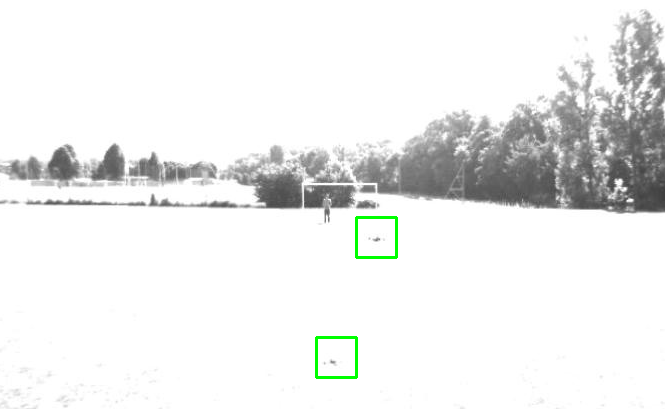

# Flying-Objects-Detection-and-Recognition

### Abstract
In our [paper](https://drive.google.com/open?id=1Tbdc_g28OLYOTbSINTVlsNs65cu4GPRd) we propose some techniques to detect
Unmanned Aerial Vehicles (UAVs), aka drones, in a
real life scenario, such as airports. Using the dataset
of Artem Rozantsev (a collection of drones and no-
drones sample patches) we try to investigate different
approaches to overcome such a challenging problem to
identify flying objects in different background scenarios
and recognize them to be drones or not.

### Train VGG19
To train the network as explained in the paper you need to download the dataset uav200 from 
[here](https://cvlab.epfl.ch/research/research-unmanned/research-unmanned-detection/ ) and put "data" into
data folder (or your own samples). Then launch main.py file.

### Detect
To use the network, divide the video you want to test into jpg frames and load them into video_test folder.
Then launch sliding_window.py (change weights accordingly for predictions if needed). You 
can download our weights from [here](https://drive.google.com/open?id=1DA5a4oi9HadxAI8UEwWn1mCA0NU1oVnp)

 
